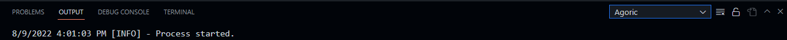

# Agoric Platform Extension for Visual Studio Code

This extension automates the installation and setup of Agoric SDK for DeFi development in JavaScript.

It assits in setting up your environment for building and deploying secure DeFi on Agoric - a Proof-of-Stake chain, with composable JavaScript Smart Contracts. 

## Prerequisites

- Node.js LTS (version 14.15.0 or higher)
- [node-gyp](https://www.npmjs.com/package/node-gyp) **(you can check for this by running `node-gyp help` in your terminal)**
- Yarn (`npm install -g yarn`)

Platform specific requirements are found on the Agoric SDK [repo](https://github.com/Agoric/agoric-sdk#readme)

## Options

### agoric.autoUpdate

By default, on startup, **Agoric** checks for SDK updates at the NPM registry and updates the version locally.
If want to opt out of this, set the `agoric.autoUpdate` option to false. Eg:

```json
{
  "agoric.autoUpdate": false
}
```

### agoric.installDir

By default, this extension installs the Agoric SDK in the home directory. Configure a custom install directory by changing the field. Eg:

```json
{
  "agoric.installDir": "/another-path"
}
```

## Keyboard Shortcuts

- <kbd>CTRL/CMD</kbd> + <kbd>Shift</kbd> + <kbd>A</kbd> : Checks for SDK updates then installs & setups the new Agoric SDK version.

## Installation

You can install the official release of the Agoric extension by following the steps in the Visual Studio Code documentation. In the Extensions pane, search for "Agoric" extension and install it there.

## Viewing Debug logs

You can view the debug logs of the setup in the 'Agoric' output channel by:

- pressing <kbd>CTRL/CMD</kbd> + <kbd>Shift</kbd> + <kbd>U</kbd> on your keyboard
- switching to the Agoric output channel as seen in the image below:
  

## Running this extension locally

- Clone this repo
- Cd into the project folder
- Install the project dependencies
- Type <kbd>F5</kbd> then choose 'Run Extension' to interact with the extension or 'Extension Tests' to Run the extension integration tests.

This extension is also installable on other non-local vscode platforms like vscode.dev, github.dev e.t.c
